# Archibald - Demo UI
 This is a demonstration user interface which shows an Archimate UI, with hard-coded arhcimate nodes and edges. This is a precursor to a more full-fledged UI that will connect to a back-end graph database hosting archimate data. This utilizes hard-coded data that shows all of the basic Archimate items. 

## Todo Features:
  - Add ability to move edges between node anchors
  - Add node data view - a view attached to nodes that show node-specific data
  - Add Junction for Edges 
  - Add ability to add edge anchors to allow more then five segments
  - Add ability to delete edge anchors
  - Add rule processing for connectors
  - ~~Add Product card~~
  - Add nesting of items with resizable cards
  - Add physical items new to 3.2 Technology Layer 

## Known Issues:
  - Selecting Edge does not update Edge Data UI component with current edge
  - Issues with drag and drop within SVG canvas makes it difficult to drag items - this is especially prevalent when trying to add a new edge
  - ~~The Communication Network is currently using Archimate 3.1 graphic~~

## Overview
This demo shows all of the Archimate 3.2 cards and allows them to be connected using the Archimate connectors as defined in the [Archimate 3.2](https://pubs.opengroup.org/architecture/archimate32-doc/index.html) definition. Archimate is a metamodel language for modeling enterprise architecture. This UI shows a complete set of the Archimate "cards". These cards are rendered on an SVG canvas and allow the user to move them and connect them utilizing the standard Archimate connectors.

### Nodes
| Name | Layer | Type | Description | 
| --- | --- | --- | --- |
| Collaboration | Application | Structure | An _Application Collaboration_ is the representation of two or more internal active structural elements that come together and jointly produce an application behavior. A collaboration is typically represented by a _noun_. |
| Component | Application | Structure | An _Application Component_ is a modular, functional structure, encapsulating behavior and data. It is independently deployable. It can represent entire applications or pieces of an application. |
| DataObject | Application | Structure | A Data Object represents a data structure that is used for automated data processing. A _log_ or a _HEDIS measurement_ could be data objects. |
| Event | Application | Behavior  | An application state change is known as an _Application Event_. It is an instantaneous occurance that can start (trigger) an application behavior or otherwise modify an ongoing process's behavior.|
| Function | Application | Behavior | _Application Functions_ are the internal behaviors of an _Application Component_. They are typically represented by verbs ending in _ing_, e.g. accounting. |
| Interaction | Application | Behavior | An _Application Interaction_ represents the behavior derived from the collaboration between two or more _Application Components_. |
| Interface | Application | Structure | The exposed point of access to an _Application Service_ is known as an _Application Interface_. |
| Process | Application | Behavior | An _Application Process_ is a sequence of application behaviors that are performed in order to acheive a specific result. For example, a medical billing claims process includes behaviors such as submitting claims, reconciling results, corrections and resubmissions in order to verify that the claim has been paid. |
| Service | Application | Behavior | A behavior that has been specifically exposed is known as an _Application Service_. |
| Actor | Business | Structure | An _Actor_ is a business entity that performs a behavior - this could be a person, or a departmnent of organizational unit. Actors are often assigned roles. |
| Collaboration | Business | Structure | A _Business Collaboration_ occurs when two structure elements work together to perform a behavior. |
| Contract | Business | Passive Structure| A _Contract_ is a specification, including functional and non-functional requirements, between a provider and a consumer of an interaction. |
| Event| Business | Behavior | A _Business Event_ is an instantaneous occurance that impacts (starts, interrupts) a business process. |
| Function | Business | Behavior | A _Business Function_ represents an internal behavior grouped by skills, competencies or knowledge. For example, Sales or Customer Management. |
| Interaction | Business | Behavior | When two or more roles, actors, or _Business Collaborations_ come together to complete a behavior, this is known as a _Business Interaction_. |
| Interface | Business | Structure | A _Business Interface_ represents a channel through which business services are exposed. For example, the web, telephone, store, etc. |
| Object | Business | Passive Structure | A concept used within the business domain is known as a _Business Object_. An insurance policy is a _Business Object_ that is supported by certificates of insurance and other representations. |
| Process | Business | Behavior | _Products_ and _services_ are produced by _Business Processes_, which are internal complex chains of activities by roles to realize the service or product. |
| Product | Business | Passive Structure | A _Product_ is a collection of services and passive structure elements that is offered to a client. _Products_ are governed by a contract. |
| Representation | Business | Passive Structure | _Representations_ are units of information, such as forms or messages, that are perceptible components of a _Business Object_.  |
| Role | Business | Structure | _Roles_ represent the responsibility for performing specific behaviors. For example, an actor may be assigned a role to process applications. |
| Service | Business | Behavior | A _Business Service_ represents a specific behavior that is exposed by the business. It is performed by an actor, role or through a specific collaboration. |
| Assessment | Motivation | Motivation | An _Assessment represents the results on an analysis of the state of the enterprise in respects to a defined _Driver_. For example, in respect to a market share driver, an assessment may be made that market share is declining because of advanced AI features of competitor's products are making current services less valuable. |
| Constraint | Motivation | Motivation | A _Constraint_ is a limitation that has an impact on the implementation of a solution. It could be a time cor resource constraint, for example. |
| Driver | Motivation | Motivation | A _Driver_ is a condition (either internal or external) that provides modivation to set and achieve goals. |
| Goal | Motivation | Motivation | The desired end-state for an organization and its stakeholders is defined by a _Goal_. This represents the intent and direction that is desired by the stakeholders. |
| Meaning | Motivation | Motivation | A _Meaning_ is a context-based interpretation of a concept or a statement of intent for a given concept. |
| Outcome | Motivation | Motivation | An _Outcome_ is a tangible end result or effect of an architecture, as produced by the capabilities of the organization. |
| Principle | Motivation | Motivation | A _Principle_ is a context-based statement of intent or guiding rule that applies to the architecture.  Principles are strongly related to goals and requirements. |
| Requirement| Motivation | Motivation | A statement of need is a _Requirement_. It models a property that is needed to acheive the goals. |
| Stakeholder | Motivation | Motivation | A _Stakeholder_ represents a represents a party that has an interest in the architecture. This could be an individual, team,  or organization that is internal or external to the enterprise. |
| Value | Motivation | Motivation | _Value_ is the relative  benefit or desirability for a stakeholder through the use of a service. |
| Capability | Strategy | Behavior | _Capabilities_ represent a capacity to deliver something. It is associated with active structure elements such as an actor, role, organizational unit or system. |
| Course of Action | Strategy | Behavior | A _Course of Action_ is a plan or defined approach to align resources and capabilities to acheive a goal -- in short, it is the plan the enterprise will use to acheive the goal. |
| Resource | Strategy | Structure  | Either tangible or intangible, a _Resource_ is an asset that is controlled by the organization or other party and can be utilized to achieve strategic goals. |
| Value Stream | Strategy | Behavior |  A _Value Stream_ is a sequential series of activities that provides a desired end-result for a stakeholder and in doing, creates value. |
| Artifact | Technology | Passive Structure | An _Artifact_ is a representation of data that is used or produced by a system. It is typically a representation of source files, compiled resources, database objects or other information that can be stored in a database or file system. |
| Collaboration | Technology | Active Structure | A _Technology Collaboration_ is when two or more internal active structure elements work together to perform a technology behavior. It is typically represented by a noun, such as "Account Reconciliation" which interacts with accounting and billing components. |
| Communication Network | Technology | Active Structure | Represents a set of structures that connects _Devices_ or _System Software_ for the movement of data. |
| Device | Technology | Active Structure | Physical devices with processing capabilities are modeled as _Devices_. A _Device_ can be small, such as a smart phone, or a large Mainframe, or in between like a router. |
| Distribution Network | Technology | Physical Structure | A _Distrubution Network_ is a physical network used to distribute material. |
| Equipment | Technology | Physical Structure | _Equipment_ is a physical asset used in the production, storage, transforming or transportation of _Materials_. |
| Event | Technology | Behavior | A _Technology Event_ is a technology state change.  It is usually represented as a perfect tense verb, such as "batch job completed" and often are used to start or modify technology behavior. |
| Facility | Technology | Physical Structure | A _Facility_ is a structure or environment that has an important role in the business processes, particularly around production and distribution. |
| Function | Technology | Behavior | A _Technology Function_, represented by a verb ending in "-ing", is a collection of technology behaviors such as |
| Interaction | Technology | Behavior | A _Technology Interaction_ is when two or more internal active structure elements perform a business behavior. For example, when a application component updates a database. |
| Interface | Technology | Active Structure | A point of access for a technology service, Represented as a noun, the interface exposes a service. For example, it may be an _ATM_, or _Point of Sale_ device. |
| Material | Technology | Physical Structure | _Material_ is tangible physical matter or energy. |
| Node | Technology | Active Structure| A _Node_ is a computational or physical resource. It is used to host or manipulate other computational resources. For example, you may have an "Application Server" node that is hosted on a "Blade" device and hosts a Linux OS, Inginx server and application system software. |
| Path | Technology | Active Structure | A _Path_ is a link between two or more internal active structure elements through wich data or _Materials_ are transfered. |
| Process | Technology | Behavior | A unit of technology behavior performed by a collaboration of two or more internal active structure elements is a _Technology Process_. It is commonly represented as a verb-noun phrase, such as "replicate database". |
| Service | Technology | Structure | A _Technology Service_ is a defined, exposed technology behavior such as data-archiving, user authenticating, etc. It typically is a verb ending in _-ing_. |
| System Software | Technology | Active Structure | _System Software_ is a defined software that is used in the processing, storing and transmission of data or using of software. For example, "Ubuntu Linux OS", ".NET FRamework", "Oracle RDBMS". |
  
  ### Edges 
  | Name | Type | Description |
  | -- | -- | -- |
  | Access | Structural | Used between a Behavior or Active with a Passive structural element, this indicates that the active structural element or behavior  can observe or act on the passive element. For exammple, a create claim process will access a claim data object. |
  | Aggregation | Structural | Indicates that the compenent combines _one or more_ of another component. |
  | Assignment | Structural | Indicates that that one component executes, stores, performs a behavior or is responsible for another. This always points from an active structure to either a passive structure or behavior or a behavior to a behavior. |
  | Association | Dependency | Representing an unspecified relationship, the _Association_ connector is often transformed over time to show a more specific relationship as it becomes identified. |
  | Composition | Structural | Indicates that a component is the result of two or more other concepts being brought together. Composition requires that  |
  | Flow | Dynamic | Represents that their is a transfer (of information, goods, money, etc.) between two behavior elements. It should be annotated with what is being transferred.  |
  | Influence | Dependency | The _Influence_ connector is used with the Motivation layer to indicate that one element affects the implementation or function of another element. It is often annotaed to describe the influence (e.g., +/- or a numeric value). |
  | Realization | Dependency | Represents that an element plays a formative or critical role in another element. For example, a "Transaction Processing" function realizes a "Billing Service". |
  | Serving | Dependency | Indicates that an element provides it functionality to another element, e.g., an insurance claim reporting interface serves an insurance customer. | 
  | Specialization | Other | Similiar to the "generalization" relationship in UML, the _Specialization_ connector defines a relationship between two elements of the same kind, indicating that they share the same root behavior, but one is more targeted in its approach. For example, you may have a business function of making a vehicle claim, with specialization for Auto, Boat and Airplane. |
  | Triggering | Dynamic | Indicates that their is a causal relationship between two elements, where one element may initiate the other. |